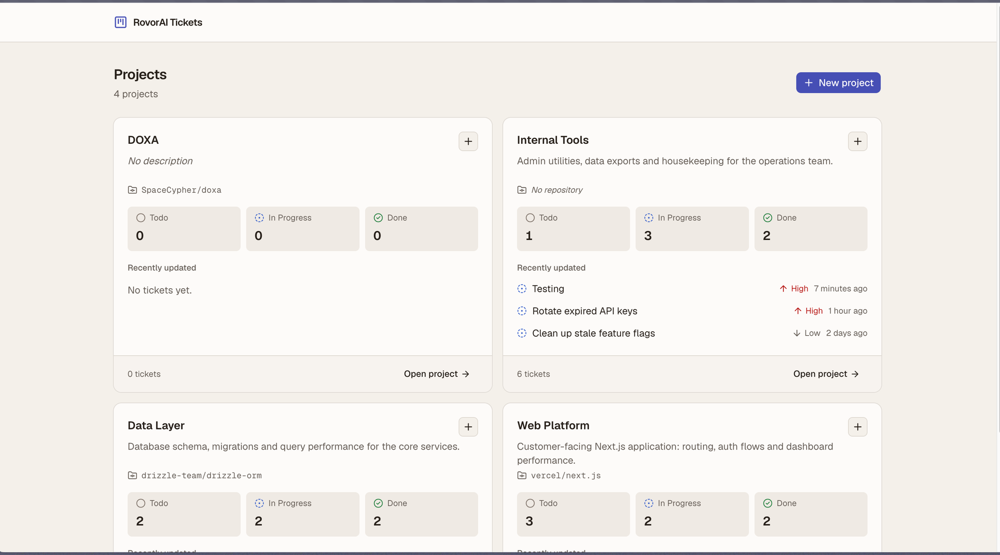
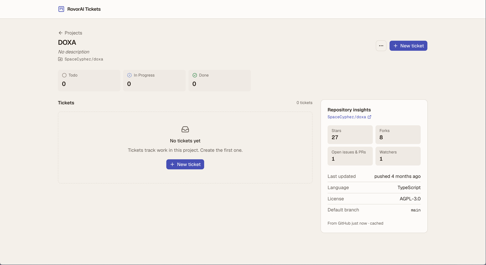
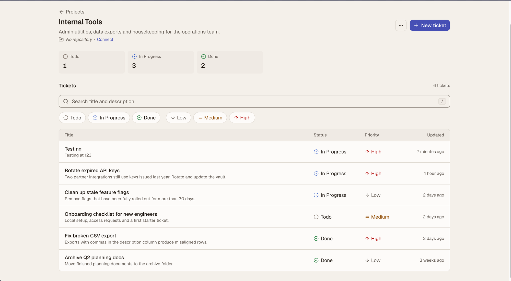
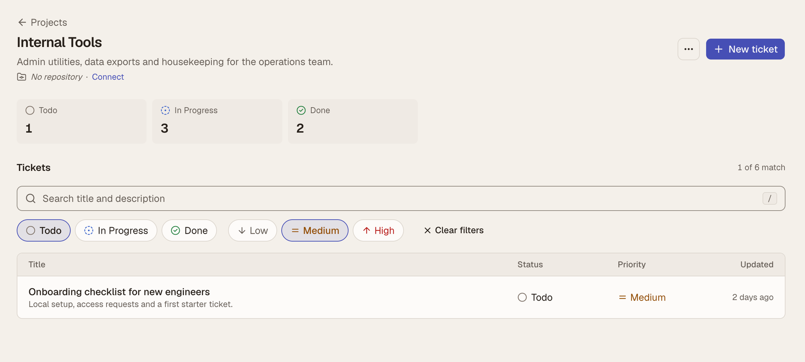
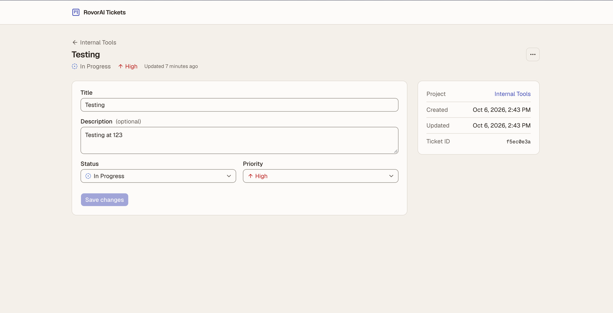
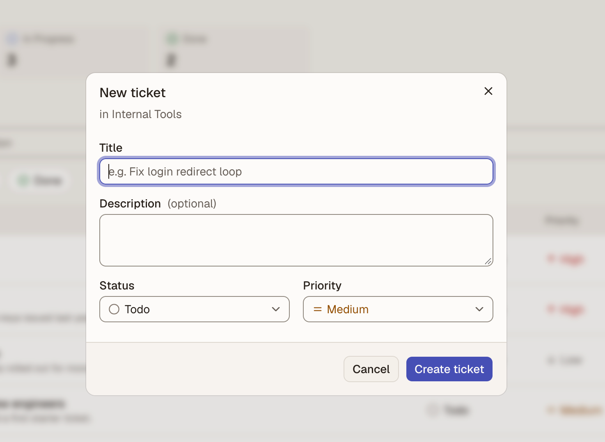
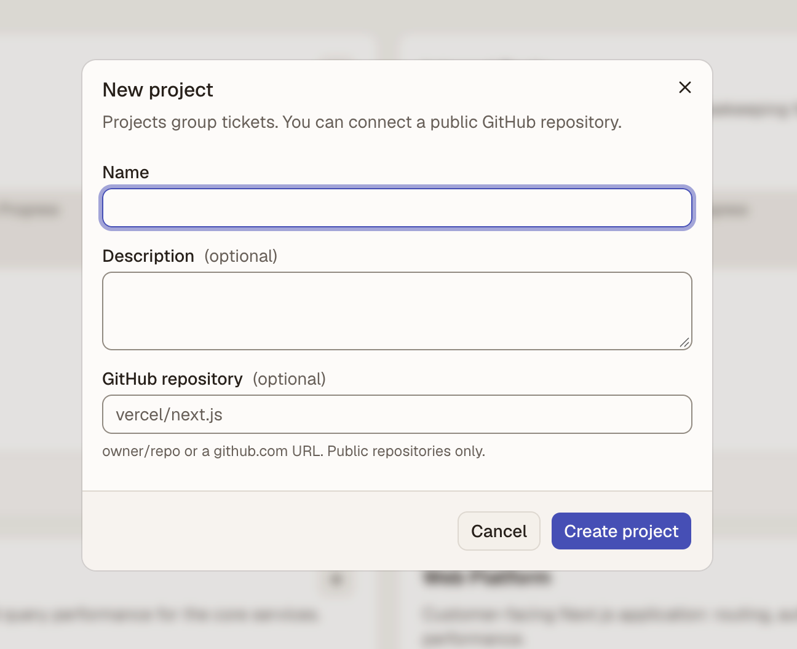
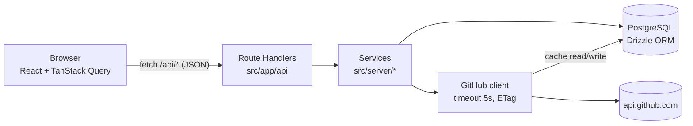

# RovorAI Tickets

A small project and ticket manager built for the RovorAI Full Stack Developer assignment. It covers a dashboard of
project cards, a project page with server-side search and filters, ticket create and edit, and GitHub repository
insights cached for 5 minutes.

**Live demo:** _added after deployment (Vercel + Neon)_ · **Stack:** Next.js 16, TypeScript, PostgreSQL, Drizzle ORM, TanStack Query, Tailwind CSS 4



---

## Contents

- [Try it in 2 minutes](#try-it-in-2-minutes)
- [How I built this](#how-i-built-this)
- [Screenshots](#screenshots)
- [Run it locally](#run-it-locally)
- [Architecture](#architecture)
- [Frontend state and data](#frontend-state-and-data)
- [Database and data model](#database-and-data-model)
- [GitHub integration and caching](#github-integration-and-caching)
- [API](#api)
- [Decisions and trade-offs](#decisions-and-trade-offs)
- [Testing and quality](#testing-and-quality)
- [Assumptions, known limitations, incomplete functionality](#assumptions-known-limitations-incomplete-functionality)
- [AI usage](#ai-usage)

## Try it in 2 minutes

The seed data has 3 projects and 18 tickets. A few things worth trying:

1. **Changes show up everywhere without a refresh.**
   - Open **Web Platform**, filter to **Todo**, open a ticket, set it to **Done** and save.
   - Press the browser's **Back** button: the filter is still applied, the ticket has left the list and the counts have
     changed.
   - Go to the dashboard: the card shows the new counts too. No page reload happens at any point.
2. **Search runs on the server.**
   - Press `/` anywhere on a project page and type `login`.
   - Combine it with the status and priority chips.
   - Filters live in the URL, so reloading or sharing the link keeps them.
3. **Quick create.** Use **+** on any dashboard card to create a ticket for that project, then watch the card update.
4. **Repository insights.**
   - **Web Platform** and **Data Layer** show stars, forks, open issues and PRs, watchers and last-updated time from
     GitHub.
   - The footer of the panel says when the data was fetched and whether it came from the cache.
   - To try your own, create a project and paste any public repo URL. A repo that doesn't exist is rejected when you
     save.
5. **Concurrent edits don't overwrite each other.**
   - Open the same ticket in two tabs and save in one.
   - Now save in the other: a banner keeps your text and lets you choose **Overwrite with mine** or **Load latest**.
6. **Failure states.**
   - In DevTools, set the network to **Offline** and try to save: you get a clear error, and your draft is kept.
   - A project id that doesn't exist (e.g. `/projects/00000000-0000-4000-8000-000000000000`) shows a "not found" page.

## How I built this

I ran this like a small production team. **I was the product owner and final reviewer.** Claude Code worked as the
engineering team, split into fixed roles (defined in
[`RovorAI_Engineering_Roles.md`](RovorAI_Engineering_Roles.md)), and each role owned a review gate.

| Role                                     | Owns                                                                                                                          |
| ---------------------------------------- | ----------------------------------------------------------------------------------------------------------------------------- |
| **Me: product owner and final reviewer** | Scope, product and design calls, approving every commit and outward-facing step (repo, deploy, secrets), and hands-on testing |
| Staff Engineer / Architect               | Boundaries, trade-offs, scope control                                                                                         |
| Senior Full-Stack Engineer               | Implementation of each phase                                                                                                  |
| Backend + Database Reviewer              | API contracts, validation, queries, indexes, data integrity, caching                                                          |
| Frontend + UX Reviewer                   | State, every loading, empty and error state, accessibility, responsive layout                                                 |
| Product / Requirements Reviewer          | Every PDF requirement actually met, and nothing unnecessary added                                                             |
| Staff Engineer / Production Gate         | Security, reliability, tests, deployment readiness                                                                            |

**The process:**

1. **Requirements before code.** The PDF became [`REQUIREMENTS.md`](REQUIREMENTS.md): every line has an ID, acceptance
   criteria and the test that proves it.
2. **Architecture before code.** [`ARCHITECTURE.md`](ARCHITECTURE.md) holds the decisions, each with its reason and its
   cost. Every later question was answered by the role that owns it and logged (decisions L1–L17).
3. **Phased build with gates.** There were 12 phases. Each ends with a runnable check, with the output shown, followed
   by a review from the owning role. A phase doesn't close until its review passes, and every finding is recorded with a
   severity under "Phase reviews" in `ARCHITECTURE.md`.
4. **I stay in the loop.** I approved each commit, made the product and design calls, and tested the running app
   myself.

**Where I overruled or redirected:**

- I kept project edit/delete and ticket delete after the Product Reviewer recommended cutting them (L4).
- I rejected the first near-white colour scheme and chose from three rendered alternatives (L15).
- Testing in my own dark-mode browser, I found gray inputs that no automated test had caught (L16).
- I flagged dead space on projects without a repository (L17).

### What the gates caught

Real findings from this build. All are fixed, and the regression-prone ones have tests.

| Severity      | Finding                                                                                                                                               | Caught by                                                         |
| ------------- | ----------------------------------------------------------------------------------------------------------------------------------------------------- | ----------------------------------------------------------------- |
| High          | Failed-query logs included user-entered text in **production builds only**. The redaction checked the error's class name, which the bundler minifies. | Backend review: a live production build with the database stopped |
| High          | Saving while offline left the button spinning forever. The data library pauses offline saves by default.                                              | Phase 8 resilience test                                           |
| High (a11y)   | The status and priority dropdowns had no accessible name for screen readers                                                                           | e2e test                                                          |
| Medium        | A database outage returned 500 instead of a retryable 503                                                                                             | Backend review, database stopped live                             |
| Medium        | A planned assumption, that GitHub `304` responses don't use up the rate limit, turned out false                                                       | Checked against the live API before relying on it                 |
| Medium        | A regex escaping slip would have rejected every short repo name such as `a/b`                                                                         | DB review, reading the generated SQL                              |
| Medium (perf) | Clicking a filter took about 200 ms to respond under throttling; it now takes 14–22 ms                                                                | Measured speed pass                                               |
| Medium (UX)   | Gray inputs for anyone whose OS is in dark mode                                                                                                       | **Me**, testing in my own browser                                 |

### What I do differently

- **Requirements are a checklist with evidence, not a feeling.** Every PDF line maps to a test or a recorded check, and
  [the final requirements review](REQUIREMENTS.md) re-reads the PDF itself, not my notes about it.
- **Claims come with measurements.** Speed was measured before and after each fix. Assumptions about external APIs were
  checked against the live API, and the docs were corrected when one turned out wrong.
- **Tests have to prove they can fail.** I break the code on purpose to check that the right tests go red:
  - disabling the status filter fails exactly the 2 filter tests;
  - changing the search expression fails the index-usage test;
  - forcing every cache lookup to miss fails 6 cache tests.
- **Guardrails instead of relying on care:**
  - integration tests refuse any database whose name doesn't end in `_test`;
  - the seed script refuses to reset a remote database;
  - a lint rule stops UI code from importing server code;
  - configuration is validated when the server starts.
- **Failure modes are designed, not discovered in production.** Each one is handled and tested:
  - database down → retryable 503;
  - GitHub down or rate-limited → last cached copy, marked stale;
  - 5-second timeouts on GitHub calls;
  - offline → a clear error, with the draft kept;
  - two tabs saving at once → a conflict banner instead of a lost edit;
  - deleting something already gone → treated as success.
- **Every screen state is designed and checked:** loading, empty, error, stale and overflow, at 375–1920 px, keyboard
  only, and with axe accessibility scans in CI.
- **Docs are honest.** Trade-offs come with their cost and numbers attached, and limitations are listed instead of
  hidden.

## Screenshots

| Project with repository insights            | Ticket list                               |
| ------------------------------------------- | ----------------------------------------- |
|   |  |
| **Search + filters (backend, combinable)**  | **Edit a ticket**                         |
|     |      |
| **New ticket (from a card or the project)** | **New project (optional GitHub repo)**    |
|         |      |

## Run it locally

**Prerequisites:** Node.js 22, pnpm 10 (`corepack enable` installs the pinned version), Docker.

```bash
cp .env.example .env.local      # local defaults work as-is; GITHUB_TOKEN is optional
docker compose up -d            # Postgres 16 on host port 5433 (+ a rovor_test database)
pnpm install
pnpm db:migrate                 # applies the SQL migrations in drizzle/
pnpm db:seed                    # 3 projects, 18 tickets (resets local data)
pnpm dev                        # http://localhost:3000
```

There is no separate backend process to start. The API runs inside the same Next.js app (see
[Architecture](#architecture)).

| Command                                    | What it does                                                                                              |
| ------------------------------------------ | --------------------------------------------------------------------------------------------------------- |
| `pnpm dev` / `build` / `start`             | Develop, build or serve the production build                                                              |
| `pnpm test`                                | Unit tests + API integration tests against the `rovor_test` database                                      |
| `pnpm e2e`                                 | Playwright end-to-end tests against a production build (run `pnpm exec playwright install chromium` once) |
| `pnpm lint` / `typecheck` / `format:check` | Static checks (all run in CI)                                                                             |
| `pnpm smoke [url]`                         | API smoke test over HTTP, against local or deployed; creates and deletes its own data                     |
| `pnpm db:seed:if-empty`                    | Seeds only an empty database (used for production)                                                        |

**Environment variables** (`.env.example`):

| Variable                | Required    | Purpose                                                                                   |
| ----------------------- | ----------- | ----------------------------------------------------------------------------------------- |
| `DATABASE_URL`          | yes         | Runtime connection (Neon **pooled** URL in production)                                    |
| `DATABASE_URL_UNPOOLED` | production  | Direct connection for migrations                                                          |
| `DATABASE_URL_TEST`     | tests       | Integration-test database (must end in `_test`; tests refuse anything else)               |
| `GITHUB_TOKEN`          | recommended | Fine-grained, public-read token. Raises GitHub's limit from 60 to 5,000 requests per hour |
| `LOG_LEVEL`             | no (`info`) | Structured JSON log verbosity                                                             |

The server validates its configuration with Zod at startup and refuses to serve requests if it's invalid.

## Architecture



It's a single Next.js 16 app. The PDF allows either an API inside Next.js or a separate service, and I chose one app:
one deployment, no CORS, and shared TypeScript types. The trade-off is kept honest by enforcing the boundary:

- `src/server/**`: backend only. Every module imports `server-only`, and an **ESLint rule** fails the build if UI code
  imports it.
- `src/app/api/**`: thin route handlers. They parse input, call a service and map errors to HTTP. A shared `withApi`
  wrapper adds a request id, `Cache-Control: no-store` and one structured JSON log line per request.
- `src/shared/**`: Zod schemas, domain constants and API types, used by **both** the forms and the API, so validation
  can't drift between them.
- `src/features/**`: UI by feature (projects, tickets, repository), using `src/lib/api-client.ts`, a typed client for
  our own API. The browser never talks to GitHub or the database.

## Frontend state and data

| State              | Where it lives                                                         |
| ------------------ | ---------------------------------------------------------------------- |
| Server data        | TanStack Query cache                                                   |
| Search and filters | The URL (`?q=&status=&priority=`): shareable, survives reload and Back |
| Form drafts        | React Hook Form + Zod resolver (same schemas as the API)               |
| Dialogs, menus     | Local component state                                                  |

**How the "no manual refresh" requirement is met.** Every mutation goes through one invalidation map in
`src/lib/query-keys.ts`, so there's a single place that decides what's stale after a change:

- **Ticket change:** refreshes the dashboard list, the project counts and every filtered ticket list for that project.
  It deliberately leaves the GitHub insights alone, since tickets don't affect them.
- **Project edit:** refreshes the dashboard and the project header. Insights refresh only if the repo changed.
- **Project delete:** navigates away first, then _removes_ the cached queries so nothing refetches into a 404.

Updates are **server-confirmed, not optimistic**: the UI shows what the database saved, which is what the PDF asks for.
Filter changes use the native `history.replaceState`, which Next 16 syncs into `useSearchParams` without a server
round trip.

## Database and data model

PostgreSQL. Docker locally, Neon in production.

```
projects 1 ── * tickets          github_repo_cache (keyed by lower(owner/repo))
```

| Table               | Notes                                                                                                                                                                         |
| ------------------- | ----------------------------------------------------------------------------------------------------------------------------------------------------------------------------- |
| `projects`          | `name` (unique, case-insensitive), `description`, optional `github_repo` stored as canonical `owner/repo`, `version`                                                          |
| `tickets`           | FK to project with `ON DELETE CASCADE`; `status` (`todo`/`in_progress`/`done`) and `priority` (`low`/`medium`/`high`) as Postgres enums; `version`; `created_at`/`updated_at` |
| `github_repo_cache` | Normalized repo data (JSONB), ETag, `fetched_at`, and `ok`/`not_found` status                                                                                                 |

- **Constraints mirror the API's validation** (non-blank names, length limits, repo format), so bad data is rejected
  even if something writes around the API.
- **Indexes:**
  - `(project_id, updated_at DESC)` for lists and the dashboard's "recently updated" tickets;
  - a **trigram GIN index** for `ILIKE` substring search, so "auth" finds "authentication". A test checks that the
    generated query actually uses it.
- **Dashboard queries:** two queries regardless of project count. One aggregates counts with `FILTER`, the other takes
  the 3 most recent tickets per project with `row_number()`.
- **Optimistic locking:** updates apply `WHERE version = $n` and return 409 with the current row if someone saved first.
  The version is an integer, not a timestamp: Postgres stores microseconds and JavaScript dates only milliseconds.
- **Migrations** are plain SQL files in `drizzle/`, generated by drizzle-kit and committed.
- **Seed:** `pnpm db:seed` resets **local** databases only and refuses remote hosts. `db:seed:if-empty` is the
  production-safe variant.

## GitHub integration and caching

- **Input:** `owner/repo` or any github.com URL (with `.git`, `/tree/main`, `?tab=…` and so on) is normalized to
  `owner/repo` by one parser shared by the form and the API. Other hosts, credentials in URLs and path tricks are
  rejected. The server only ever calls `https://api.github.com/repos/{owner}/{repo}` built from validated parts, never a
  user-supplied URL.
- **What's shown:** stars, forks, open issues and PRs, watchers, last updated (last push), language, license and default
  branch.
  - _Open issues and PRs:_ GitHub's `open_issues_count` includes pull requests, so it's labelled that way.
  - _Watchers:_ GitHub's `watchers_count` equals the star count; the real number is `subscribers_count` (verified
    against the live API).
- **Cache: Postgres, 5-minute TTL.** Serverless instances don't share memory, so the cache is a table:
  - **Fresh (< 5 min):** served from Postgres, with no call to GitHub.
  - **Expired:** revalidated with `If-None-Match` (ETag). A `304` reuses the cached copy.
  - **GitHub down or rate-limited:** the last good copy is served, clearly marked as stale.
  - **Missing repo:** remembered for 5 minutes too (negative caching).
  - **Case-insensitive key:** `Vercel/Next.js` and `vercel/next.js` share one cache entry.
- **Write-time check:** creating or editing a project with a repo GitHub confirms is missing is rejected (422). If
  GitHub is unreachable the save still succeeds; GitHub should never block our core writes.
- **Measured, not assumed:** a live test showed an unauthenticated `304` **still** counts against GitHub's rate limit.
  So ETags save bandwidth here, not quota. The quota protection comes from the cache plus `GITHUB_TOKEN` in production.

## API

All JSON. Success is `{ data, meta? }`; errors are `{ error: { code, message, details?, requestId } }`. Invalid ids
return 404, never a database error.

| Method & path                                        | Purpose                                                             |
| ---------------------------------------------------- | ------------------------------------------------------------------- |
| `GET /api/projects`                                  | Dashboard: projects with counts + 3 recent tickets                  |
| `POST /api/projects`                                 | Create (validates, normalizes repo, checks it exists)               |
| `GET /api/projects/:id`                              | Project + ticket counts                                             |
| `PATCH /api/projects/:id` · `DELETE …`               | Edit (with `version`) · delete (cascades tickets)                   |
| `GET /api/projects/:id/tickets?q=&status=&priority=` | Search + filters (combinable, comma lists)                          |
| `POST /api/projects/:id/tickets`                     | Create ticket                                                       |
| `GET /api/tickets/:id` · `PATCH` · `DELETE`          | Read · update (with `version`, 409 on conflict) · delete            |
| `GET /api/projects/:id/repository`                   | Repository insights (`meta.cached`, `meta.stale`, `meta.fetchedAt`) |
| `GET /api/health`                                    | Database check                                                      |

Status codes used: 400 (validation, with per-field errors), 404, 409 (duplicate name or version conflict), 413, 415,
422 (repo not found), 502/503 (GitHub or database unavailable; retryable).

## Decisions and trade-offs

| Decision                                                                   | Why                                                                              | Cost I accepted                                                                                                                                    |
| -------------------------------------------------------------------------- | -------------------------------------------------------------------------------- | -------------------------------------------------------------------------------------------------------------------------------------------------- |
| One Next.js app (API in Route Handlers)                                    | One deployment, shared types, no CORS                                            | Backend scales with the web app; the boundary is enforced by lint so it could be split later                                                       |
| Client-side data fetching (TanStack Query) instead of server-rendered data | Deterministic freshness after mutations; the frontend genuinely consumes the API | First paint shows skeletons. Lighthouse LCP is about 4 s on simulated slow 4G (measured). The fix, server prefetch with hydration, is noted below. |
| Postgres as the GitHub cache                                               | Shared across serverless instances, durable, testable, no extra service          | One DB round trip per insights request                                                                                                             |
| `ILIKE` + trigram index for search                                         | Substring matching is what people expect in ticket search                        | No relevance ranking or stemming                                                                                                                   |
| Optimistic locking (`version`)                                             | Two tabs can't silently overwrite each other                                     | Occasional conflict banner                                                                                                                         |
| Hard deletes with confirmation (type the name for projects)                | Simple queries, no `deleted_at` filter everywhere                                | No undo                                                                                                                                            |
| Light theme only, contrast-checked                                         | One theme done properly beats two half-checked                                   | No dark mode                                                                                                                                       |
| No Terraform                                                               | One Vercel project + one Neon database didn't justify it                         | Infra is documented steps                                                                                                                          |

Project edit/delete and ticket delete go beyond the PDF; I added them deliberately. All architecture decisions are
logged in [`ARCHITECTURE.md`](ARCHITECTURE.md), and the requirement checklist is in
[`REQUIREMENTS.md`](REQUIREMENTS.md).

## Testing and quality

- **141 unit + integration tests** (Vitest). Integration tests call the real route handlers against a real Postgres.
  GitHub is replaced by a fake `fetch` (tests never touch the network), and the cache TTL is tested with a fake clock.
- **30 end-to-end tests** (Playwright) against a production build, including:
  - the full "edit, press Back, everything is updated, no reload" flow;
  - search and filters surviving reload;
  - conflict resolution, offline behaviour and keyboard-only use;
  - 8 automated accessibility (axe, WCAG 2.2 AA) scans, including one with the OS in dark mode.
- **CI (GitHub Actions):** format, lint, typecheck, unit and integration tests with a Postgres service, build, and the
  e2e suite.
- **Measured UX:** under simulated slow 4G with 4× CPU throttling, every click or keypress shows feedback in under 70 ms.
  Lighthouse: accessibility **100**, best practices **100**, performance 77–84.

## Assumptions, known limitations, incomplete functionality

**Assumptions:**

- No authentication (out of scope per the PDF), so anyone with the URL can read and write.
- Project names are unique, ignoring case.
- Project description is optional.
- "Recent tickets" means the 3 most recently updated.
- Project-page counts cover the whole project; the list below them is the filtered view.

**Known limitations:**

- No pagination UI. A ticket list returns at most 200 rows and says so when it truncates.
- No rate limiting on our own API.
- Leaving a page with unsaved edits via an in-app link doesn't warn (Next.js can't intercept App Router navigation).
  Reload and tab close do warn.
- Cache rows for repos that are no longer used are never cleaned up. That's harmless at this scale.
- Light theme only.
- Data is fetched in the browser, so first content waits for JavaScript (see trade-offs). The next improvement would
  be server prefetch with TanStack's `HydrationBoundary`.

**Incomplete:** the live deployment link above is added once the app is deployed.

## AI usage

<!-- DRAFT: Sanidhya, rewrite in your own words and confirm before submitting. Everything below
     describes things that actually happened in this build; keep only what you can explain. -->

**Tools:** Claude Code (Claude Opus) as a pair programmer through the whole build. I used it for:

- turning the PDF into a requirements checklist and an architecture plan;
- implementing each phase;
- running structured reviews from fixed engineering roles: architect, backend and database, frontend and UX,
  production gate.

I made the scope and design calls, ran the app myself, and pushed back on the output when it didn't look or work right.

**AI output I changed, rejected or improved:**

- **Scope:** the AI's requirements review said not to build project edit/delete or ticket delete, because the PDF
  doesn't ask for them. I overruled that and kept them, with conflict handling and type-to-confirm delete.
- **UI:** the first colour scheme was near-white on white and tiring to look at. I had the AI render three alternatives
  on the running app and picked the warm palette now in use.
- **A bug I caught that its tests missed:** when testing in my dark-mode browser, the inputs came out gray. The AI had
  deleted a line that kept the UI library's dark-mode styles switched off, and all of its tests ran in light mode, so
  none caught it. It's fixed, and an e2e test now runs with the OS in dark mode.
- **Layout:** on projects without a repository, the page reserved an empty sidebar column. I flagged it; the column now
  only appears when there's something to show.
